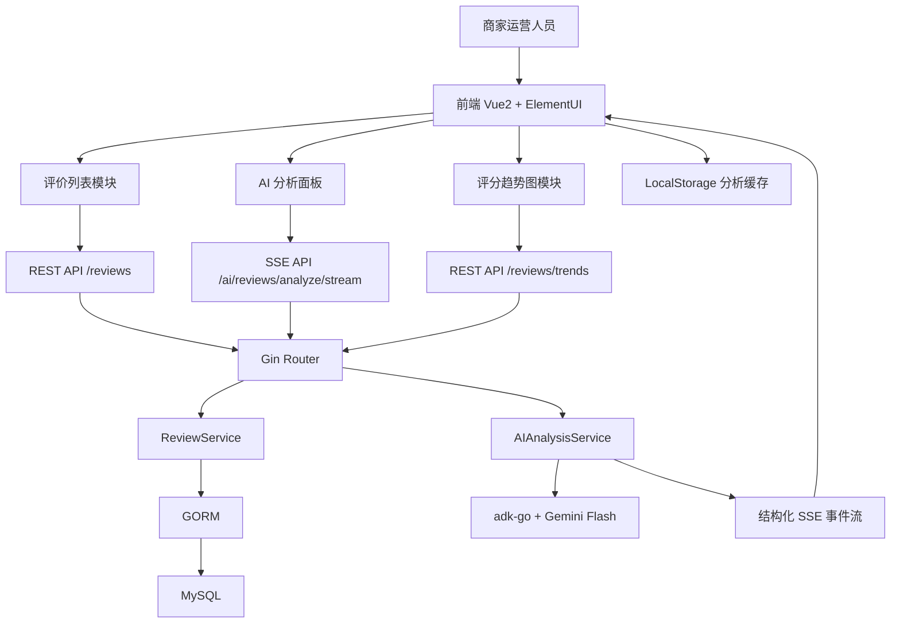
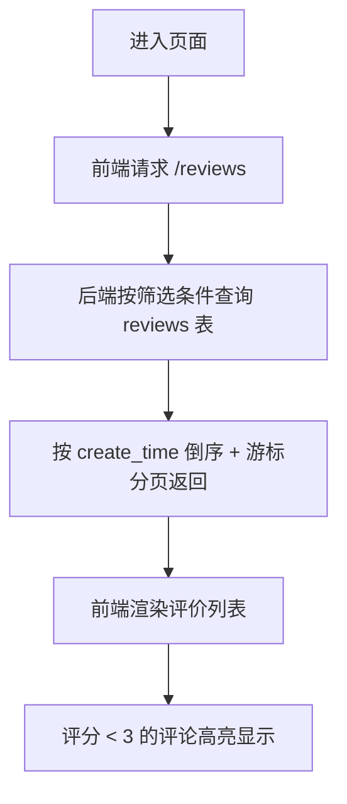
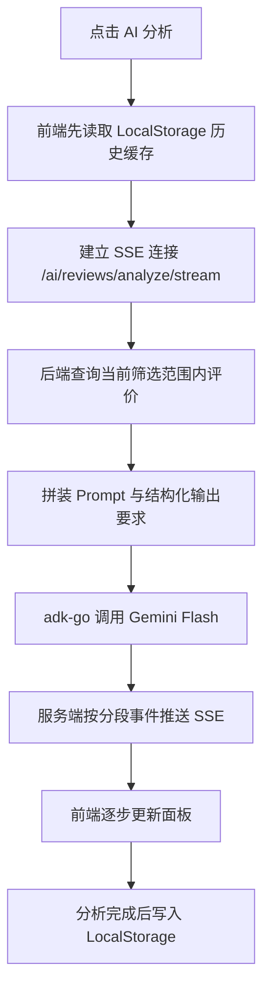
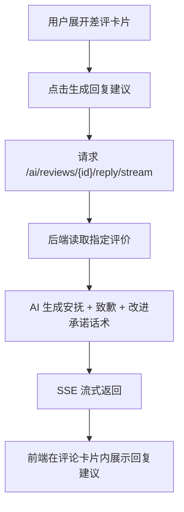

# 美食团购 AI 评价分析助手

## 1. 项目目标

基于美团美食团购场景，构建一个前后端分离的 Demo 项目，帮助商家快速查看用户评价、筛选好评/差评、分析近 7 日评分趋势，并通过 AI 自动提炼正负向关键词、综合情感评分、整体总结和改进建议。

本项目强调以下能力：

- 评价列表高效浏览：支持 Tab 筛选、按时间游标分页、低分高亮。
- AI 一键分析：基于全部评价内容聚合分析，并通过 SSE 流式输出结构化结果。
- 差评运营辅助：可扩展单条差评回复建议。
- 工程完整度：包含数据库设计、后端 RESTful API、OpenAPI 文档、Docker MySQL、前端本地缓存。

## 2. 技术选型

### 前端

- Vue 2
- Element UI
- Axios
- ECharts
- EventSource / SSE
- LocalStorage（缓存 AI 分析记录）

### 后端

- Go
- Gin
- GORM
- MySQL 8
- adk-go
- Gemini Flash 模型
- Swag / OpenAPI 文档生成

### 部署与运行

- Docker Compose（MySQL）
- 前后端分离目录：`frontend/`、`backend/`

## 3. 功能架构图




## 4. 核心流程图

### 4.1 评价列表加载流程




### 4.2 AI 一键分析流程




### 4.3 单条差评回复建议流程




## 5. 页面与交互设计

### 5.1 页面布局

- 页面采用左右双栏布局，整体贴近美团风格：
- 左侧：AI 分析工作台
- 右侧：评价列表与筛选区

### 5.2 左侧 AI 分析面板

- 顶部显示分析按钮、最近分析时间、缓存命中提示。
- 使用卡片/Collapse/Panel 结构化展示：
- 正面关键词 Top5
- 负面关键词 Top5
- 综合情感评分
- AI 改进建议 2-3 条
- 整体总结一句话
- 可扩展展示：
- 单条差评回复建议
- 本次分析覆盖评价数
- 当前筛选条件

### 5.3 右侧评价列表

- Tab：`全部` / `好评` / `差评`
- 筛选建议：
- `全部`：所有评价
- `好评`：评分 >= 4
- `差评`：评分 <= 2
- 评价项字段：
- 用户名
- 评分
- 评价内容
- 创建时间
- 低分提醒标签
- 差评卡片高亮规则：
- 评分 < 3 时，卡片增加浅红背景和警示边框
- 分页方式：
- 基于 `create_time + id` 的游标分页，优先使用“加载更多”体验

### 5.4 趋势图

- 展示近 7 日平均评分趋势折线图
- 可叠加每日评论数柱状图作为创新增强项

## 6. 前后端接口设计

### 6.1 获取评价列表

`GET /api/v1/reviews`

查询参数：

- `tab`: `all | positive | negative`
- `cursor_time`: 上一页最后一条记录时间
- `cursor_id`: 上一页最后一条记录 ID
- `page_size`: 页大小，默认 10

返回示例：

```json
{
  "list": [
    {
      "id": 101,
      "username": "张三",
      "score": 2,
      "content": "环境不错但是服务态度很差，菜品分量也比较少",
      "created_at": "2026-04-06T10:00:00+08:00"
    }
  ],
  "next_cursor": {
    "cursor_time": "2026-04-05T18:00:00+08:00",
    "cursor_id": 88
  },
  "has_more": true
}
```

### 6.2 获取近 7 日评分趋势

`GET /api/v1/reviews/trends?days=7`

返回示例：

```json
{
  "days": 7,
  "series": [
    { "date": "2026-03-31", "avg_score": 4.2, "review_count": 18 },
    { "date": "2026-04-01", "avg_score": 4.0, "review_count": 22 }
  ]
}
```

### 6.3 AI 聚合分析流式接口

`GET /api/v1/ai/reviews/analyze/stream?tab=all`

SSE 事件建议：

- `meta`：分析元数据，如任务 ID、评价数
- `positive_keywords`
- `negative_keywords`
- `sentiment_score`
- `suggestions`
- `summary`
- `done`
- `error`

单次 SSE 数据结构建议：

```json
{
  "type": "positive_keywords",
  "content": ["味道好", "环境不错", "招牌菜", "性价比高", "服务热情"],
  "delta": false
}
```

### 6.4 单条差评回复建议接口

`GET /api/v1/ai/reviews/{id}/reply/stream`

返回策略：

- 按 token 或句段推送 `reply_delta`
- 完成时返回 `done`

## 7. AI 结构化输出约束

为便于前端结构化展示，后端对模型输出做二次封装，不直接把自然语言原文透传给前端，而是要求模型按以下 JSON 结构生成，再由服务端拆分为多个 SSE 事件：

```json
{
  "positive_keywords": [
    { "keyword": "味道好", "count": 12, "sample": "味道很好，招牌烤鱼不错" }
  ],
  "negative_keywords": [
    { "keyword": "等位久", "count": 8, "sample": "就是等位时间有点长" }
  ],
  "sentiment_score": 78,
  "suggestions": [
    "高峰期优化排队叫号与预估等待时长提示",
    "加强服务人员培训，重点改善服务态度",
    "复盘套餐配置，提升饮料和分量满意度"
  ],
  "summary": "用户整体认可菜品口味，但对服务体验、等待时长和套餐细节存在明显不满。"
}
```

## 8. 数据库设计

### 8.1 核心表：`reviews`

用于存储用户团购评价。


| 字段名          | 类型          | 约束                 | 说明     |
| ------------ | ----------- | ------------------ | ------ |
| `id`         | bigint      | PK, auto_increment | 主键     |
| `username`   | varchar(64) | not null           | 用户名    |
| `score`      | tinyint     | not null           | 评分，1-5 |
| `content`    | text        | not null           | 评价内容   |
| `created_at` | datetime    | not null           | 评价创建时间 |
| `updated_at` | datetime    | not null           | 更新时间   |
| `deleted_at` | datetime    | null               | 软删除时间  |


索引建议：

- 主键索引：`id`
- 联合索引：`idx_created_id(created_at desc, id desc)`，支持游标分页
- 普通索引：`idx_score(score)`，支持正负评价筛选

### 8.2 可选扩展表：`review_ai_records`

用于持久化 AI 分析记录。当前需求中优先缓存到浏览器本地，因此此表先作为扩展预留。


| 字段名            | 类型          | 约束                 | 说明                           |
| -------------- | ----------- | ------------------ | ---------------------------- |
| `id`           | bigint      | PK, auto_increment | 主键                           |
| `scope_type`   | varchar(32) | not null           | 分析范围，如 all/positive/negative |
| `review_count` | int         | not null           | 本次分析覆盖评价数                    |
| `result_json`  | json        | not null           | 分析结果                         |
| `created_at`   | datetime    | not null           | 创建时间                         |


## 9. review.sql 初始化建议

初始化 SQL 需要包含：

- 数据库创建语句
- `reviews` 表建表语句
- 必要索引
- 10-20 条模拟美食评价数据

推荐模拟数据覆盖：

- 好评
- 差评
- 中评
- 服务问题
- 分量问题
- 等位问题
- 菜品口味亮点

## 10. 目录结构设计

```text
meituan-aicoding/
├── AGENT.md
├── plan.md
├── docker-compose.yml
├── frontend/
│   ├── package.json
│   ├── vue.config.js
│   ├── public/
│   └── src/
│       ├── main.js
│       ├── App.vue
│       ├── api/
│       │   ├── http.js
│       │   ├── review.js
│       │   └── ai.js
│       ├── assets/
│       │   └── styles/
│       ├── components/
│       │   ├── ReviewFilterTabs.vue
│       │   ├── ReviewList.vue
│       │   ├── ReviewCard.vue
│       │   ├── AIAnalysisPanel.vue
│       │   ├── AnalysisKeywordList.vue
│       │   ├── TrendChart.vue
│       │   └── EmptyState.vue
│       ├── utils/
│       │   ├── sse.js
│       │   ├── storage.js
│       │   └── format.js
│       └── views/
│           └── ReviewDashboard.vue
└── backend/
    ├── go.mod
    ├── cmd/
    │   └── server/
    │       └── main.go
    ├── configs/
    │   └── config.yaml
    ├── docs/
    ├── internal/
    │   ├── api/
    │   │   ├── handler/
    │   │   │   ├── review_handler.go
    │   │   │   └── ai_handler.go
    │   │   ├── router/
    │   │   │   └── router.go
    │   │   └── dto/
    │   ├── model/
    │   │   └── review.go
    │   ├── repository/
    │   │   └── review_repository.go
    │   ├── service/
    │   │   ├── review_service.go
    │   │   └── ai_service.go
    │   ├── ai/
    │   │   ├── client.go
    │   │   ├── prompt.go
    │   │   └── stream_parser.go
    │   ├── pkg/
    │   │   ├── db/
    │   │   ├── logger/
    │   │   ├── response/
    │   │   └── sse/
    │   └── middleware/
    └── review.sql
```

## 11. 模块职责说明

### 前端模块

- `views/ReviewDashboard.vue`
  - 页面级容器，负责左右布局、状态整合、联动分析与列表刷新。
- `components/AIAnalysisPanel.vue`
  - 发起 AI 分析、接收 SSE、渲染结构化结果。
- `components/ReviewList.vue`
  - 管理列表加载、加载更多、空态。
- `components/ReviewCard.vue`
  - 展示单条评价、评分样式、差评高亮、差评回复建议入口。
- `components/TrendChart.vue`
  - 绘制近 7 日趋势图。

### 后端模块

- `review_handler.go`
  - 处理评价列表和趋势图接口。
- `ai_handler.go`
  - 处理聚合分析和单条回复建议的 SSE 接口。
- `review_service.go`
  - 封装评价查询、分页、趋势统计逻辑。
- `ai_service.go`
  - 封装 Prompt、调用 AI、解析结构化响应并输出 SSE 事件。

## 12. OpenAPI 文档规划

后端需为以下接口生成 OpenAPI 文档：

- `GET /api/v1/reviews`
- `GET /api/v1/reviews/trends`
- `GET /api/v1/ai/reviews/analyze/stream`
- `GET /api/v1/ai/reviews/{id}/reply/stream`

说明：

- 对 SSE 接口在文档中标注 `text/event-stream`
- 对 `tab`、游标参数、返回结构做清晰注释

## 13. 风格与体验要求

- 整体视觉贴近美团：
- 主色调建议使用橙黄体系，如 `#FFC300`、`#222222`、`#FFF7E6`
- 卡片圆角、轻阴影、信息分区明确
- 列表阅读性优先，避免信息过密
- AI 分析结果应强调“结构化”和“逐步出现”的感受

## 14. 创新点建议

在完成基础需求后，可优先实现以下增强点：

- 差评原因标签聚类，如“服务”“等位”“分量”“口味”
- 每个负面关键词挂载示例评论片段
- 趋势图增加“差评占比”折线
- 提供“今日最需要处理的 3 条差评”推荐卡片

## 15. 开发原则

- 先设计再初始化，避免目录与模块重复返工
- SSE 接口优先保证稳定可演示，其次再优化 token 级流式体验
- 前端先用本地缓存保存 AI 结果，不急于做服务端持久化
- 所有 AI 输出都尽量结构化，便于 UI 呈现
- 首轮实现以 Demo 可运行、可演示、可扩展为目标

